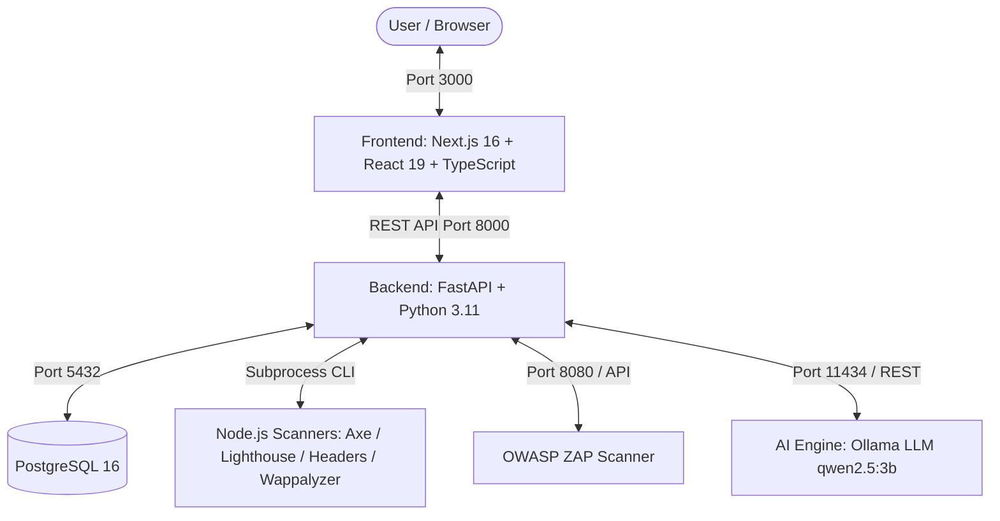

# WebScan (Potato) — AI-Assisted Web Standards & Vulnerability Assessment System

ระบบประเมินมาตรฐานและความปลอดภัยของเว็บไซต์แบบอัตโนมัติ (Automated Web Standards & Security Assessment System) ที่ผสานรวมการตรวจสอบมาตรฐานสากล 4 ด้าน (68 รายการ), การสแกนช่องโหว่ความปลอดภัย และการวิเคราะห์สรุปผลด้วย AI (Local LLM ผ่าน Ollama)

---

## 🏛️ สถาปัตยกรรมระบบ (Architecture)



---

## 📋 4 มาตรฐานหลักที่รองรับ (68 Checklist Items)

1. **WCAG 2.1 (Web Content Accessibility Guidelines)** — 37 ข้อ (axe-core + Lighthouse)
2. **Core Web Vitals & SEO** — 9 ข้อ (Google Lighthouse)
3. **สกมช. (NCSA Thailand Web Security Guidelines)** — 11 ข้อ (Headers, Wappalyzer, ZAP)
4. **OWASP HTTP Security Headers** — 11 ข้อ (Headers inspection)

---

## 🚀 การติดตั้งและเริ่มใช้งาน (Getting Started)

### ความต้องการของระบบ (Prerequisites)
- [Docker & Docker Desktop](https://www.docker.com/) (พร้อม Docker Compose v2)
- [Ollama](https://ollama.com/) ติดตั้งบนเครื่อง Host

### 1. เตรียมโมเดล AI (Ollama)
เปิด Terminal บนเครื่อง Host แล้วดึงโมเดล `qwen2.5:3b`:
```bash
ollama pull qwen2.5:3b
```

### 2. รันระบบด้วย Docker Compose
```bash
docker compose up -d --build
```

### 3. เข้าใช้งานระบบ
- **Frontend Web UI**: [http://localhost:3000](http://localhost:3000)
- **Analytics Dashboard**: [http://localhost:3000/dashboard](http://localhost:3000/dashboard)
- **Backend API Swagger Docs**: [http://localhost:8000/docs](http://localhost:8000/docs)
- **OWASP ZAP API**: [http://localhost:8080](http://localhost:8080)

---

## 📂 โครงสร้างโปรเจกต์ (Project Directory Structure)

```
Potato/
├── backend/                    # FastAPI Backend Service
│   ├── app/                    # Application package (main, config, routes)
│   ├── db/                     # Database models & connection
│   ├── services/               # Background scanning & standards mapping
│   ├── tests/                  # Automated test suite
│   ├── Dockerfile
│   └── requirements.txt
├── frontend/                   # Next.js Frontend Application
│   ├── app/                    # App Router pages & styles
│   ├── components/             # Reusable UI & Report panels
│   ├── lib/                    # Types, constants & API helpers
│   └── Dockerfile
├── scanner/                    # Node.js Scanners (Axe, Lighthouse, Headers, Wappalyzer)
├── docs/                       # เอกสารประกอบการพัฒนาและงานวิจัย
│   ├── architecture.md         # เอกสารสถาปัตยกรรมระบบโดยละเอียด
│   ├── standards_checklist.md  # ตารางและคำอธิบาย 68 มาตรฐาน
│   └── research_comparison.md  # เอกสารเปรียบเทียบเชิงวิชาการ
├── .env.example                # ตัวอย่างการตั้งค่า Environment Variables
└── docker-compose.yml          # Container Orchestration
```
