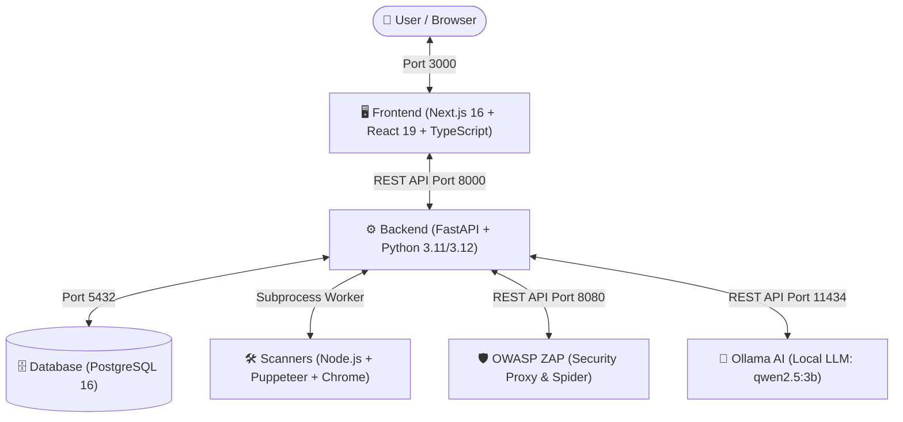

#  WebScan (Potato) — AI-Assisted Web Standards & Vulnerability Assessment System

 **ระบบประเมินมาตรฐานและความปลอดภัยของเว็บไซต์อัตโนมัติ**  
 >ตรวจสอบมาตรฐานสากล 4 ด้าน (ครบถ้วน 71 ข้อ), สแกนช่องโหว่ความปลอดภัย 

---

## 📖 สารบัญสำหรับนักพัฒนา (Developer Guide)
- [1. ภาพรวมระบบ (System Overview)](#1-ภาพรวมระบบ-system-overview)
- [2. สถาปัตยกรรมและการทำงาน (Architecture & Flow)](#2-สถาปัตยกรรมและการทำงาน-architecture--flow)
- [3. 4 มาตรฐานหลัก 71 ข้อตรวจ (71 Standards Checklist)](#3-4-มาตรฐานหลัก-71-ข้อตรวจ-71-standards-checklist)
- [4. โครงสร้างโฟลเดอร์ (Project Structure)](#4-โครงสร้างโฟลเดอร์-project-structure)
- [5. การติดตั้งและเริ่มรันระบบ (Quick Start)](#5-การติดตั้งและเริ่มรันระบบ-quick-start)
- [6. คู่มือการรันแบบแยกชิ้นสำหรับ Developer (Local Development)](#6-คู่มือการรันแบบแยกชิ้นสำหรับ-developer-local-development)
- [7. รายการ API Endpoints หลัก (Core API Routes)](#7-รายการ-api-endpoints-หลัก-core-api-routes)
- [8. การทดสอบระบบ (Testing & Quality Assurance)](#8-การทดสอบระบบ-testing--quality-assurance)
- [9. คำถามและปัญหาที่พบบ่อย (Troubleshooting & FAQs)](#9-คำถามและปัญหาที่พบบ่อย-troubleshooting--faqs)

---

## 1. ภาพรวมระบบ (System Overview)

WebScan ถูกออกแบบมาเพื่อแก้ปัญหาความยุ่งยากในการตรวจประเมินเว็บไซต์ โดยรวมเครื่องมือชั้นนำระดับโลก (เช่น Axe-core, Google Lighthouse, OWASP ZAP, Wappalyzer) เข้ามาทำงานพร้อมกันแบบอัตโนมัติ (Concurrent Scanning) แล้วแปลงผลลัพธ์เป็นรายงานมาตรฐาน 71 ข้อ พร้อม Dashboard สรุปคะแนน และ AI ที่คอยแนะนำวิธีแก้โค้ดแบบ Step-by-Step เป็นภาษาไทย

```
🌐 ใส่ URL เว็บไซต์
   │
   ▼
⚡ รัน Scanner พร้อมกัน (Axe, Lighthouse, Headers, Wappalyzer, ZAP)
   │
   ▼
📊 จัดกลุ่มและประเมินผลตาม 68 เกณฑ์มาตรฐาน (WCAG, CWV, สกมช., OWASP)
   │
   ▼
🤖 ส่งต่อผลตรวจให้ AI (Ollama LLM) วิเคราะห์ความเสี่ยงและเขียนโค้ดตัวอย่างที่ถูกต้อง
   │
   ▼
📱 แสดงผลบน Interactive Web Dashboard ที่สวยงาม เข้าใจง่าย และสั่งพิมพ์รายงานได้ทันที
```

---

## 2. สถาปัตยกรรมและการทำงาน (Architecture & Flow)

ระบบแบ่งการทำงานออกเป็น Microservices ที่เชื่อมต่อกันอย่างชัดเจน:



### หน้าที่ของแต่ละส่วน:
1. **Frontend (`/frontend`)**: หน้าเว็บ UI พัฒนาด้วย Next.js (App Router) + Vanilla CSS Design System ให้ความรู้สึกล้ำสมัย (Cyberpunk/Dark Theme), มี Interactive Dashboard, กราฟคะแนน, ตัวกรองหลักฐานโค้ด (DOM Evidence)
2. **Backend (`/backend`)**: ตัวกลางหลักที่ขับเคลื่อนด้วย FastAPI รับ URL เข้ามาแล้วสั่งรัน Scanners ต่างๆ ในรูปแบบ Async/ThreadPool และประเมินผลตามเกณฑ์ 71 ข้อ
3. **Scanners (`/scanner`)**: สคริปต์ Node.js ที่ควบคุม Headless Chrome ผ่าน Puppeteer เพื่อดึง DOM, คำนวณ Accessibility, วัด Performance, แกะ Headers และตรวจจับซอฟต์แวร์เซิร์ฟเวอร์
4. **OWASP ZAP**: รันเป็น Container แยกต่างหาก ทำหน้าที่ตรวจสอบช่องโหว่เชิงลึก เช่น XSS, SQL Injection และค้นหาหน้า Admin ลับ
5. **Ollama AI**: รัน LLM บนเครื่อง Host เพื่อความเป็นส่วนตัว (Privacy) ปลอดภัย 100% ไม่ส่งข้อมูลออกนอกระบบ

---

## 3. 4 มาตรฐานหลัก 71 ข้อตรวจ (71 Standards Checklist)

ระบบประเมินผลตาม 4 เสาหลักของมาตรฐานเว็บสมัยใหม่:

| มาตรฐาน (Standard) | จำนวนข้อ | เครื่องมือหลักที่ใช้ตรวจสอบ | ตัวอย่างการตรวจ |
| :--- | :---: | :--- | :--- |
| **1. WCAG 2.1**<br>*(Web Accessibility)* | **37 ข้อ** | `axe-core`, `puppeteer` | Alt Text รูปภาพ, Contrast สี, โครงสร้าง Heading, การใช้คีย์บอร์ด Tab, ARIA Roles |
| **2. Core Web Vitals & SEO**<br>*(Performance & Search)* | **9 ข้อ** | `Google Lighthouse` | LCP (ความเร็วโหลด), CLS (ความนิ่งของจอ), TBT, Meta Title/Desc, Canonical URL, Mobile Friendly |
| **3. สกมช. (NCSA Thailand)**<br>*(Cybersecurity Standard)* | **11 ข้อ** | `headers`, `wappalyzer`, `zap` | HTTPS Enforce, HSTS, Anti-Clickjacking, TLS Version, Weak Ciphers, Cookie Flags, CVE |
| **4. OWASP HTTP Headers**<br>*(Secure Headers)* | **14 ข้อ** | `headers_scan.js` | CSP, X-Frame-Options, X-Content-Type-Options, Referrer-Policy, COOP, COEP, CORP, X-Permitted-Cross-Domain-Policies, Clear-Site-Data, X-XSS-Protection |
| **รวมทั้งหมด** | **71 ข้อ** | — | — |

---

## 4. โครงสร้างโฟลเดอร์ (Project Structure)

สำหรับ Junior ที่เพิ่งเข้ามา แนะนำให้ทำความเข้าใจโครงสร้างไฟล์ดังนี้:

```text
Potato/
├── backend/                        # ⚙️ ฝั่ง Backend (Python / FastAPI)
│   ├── app/
│   │   ├── routes/                 # Endpoint routes แยกตามฟังก์ชัน
│   │   │   ├── standards.py        # Route หลัก /scan/standards (71 ข้อ)
│   │   │   ├── scan.py             # Route ย่อยสำหรับเทส scanner เดี่ยวๆ
│   │   │   └── ai.py               # Route วิเคราะห์ AI (/analyze/ai, /analyze/ai-fix)
│   │   ├── config.py               # ตั้งค่า Environment & Connection
│   │   └── schemas.py              # Pydantic Schemas (ScanRequest, ฯลฯ)
│   ├── services/
│   │   ├── standards/              # 🧠 Core Engine ประเมินผล 71 ข้อ
│   │   │   ├── checks.py           # รายการ 71 Check Items ทั้งหมด
│   │   │   ├── evaluators.py       # ฟังก์ชันตรวจ status: pass/fail/warning
│   │   │   ├── helpers.py          # Helper แกะข้อมูล + Status Constants
│   │   │   ├── i18n.py             # คำอธิบายภาษาไทย (Rule description)
│   │   │   └── report_builder.py   # ฟังก์ชันสร้างโครงสร้าง JSON รายงานสรุป
│   │   ├── scanner.py              # ตัวเรียกคำสั่ง Node.js Scanners และ ZAP
│   │   └── standards_mapping.py    # Proxy module สำหรับ backward compatibility
│   ├── standards_guidance.py       # ฐานข้อมูลคำอธิบายความเสี่ยงและวิธีแก้ภาษาไทย
│   ├── threat_scenarios.py         # ฐานข้อมูลสถานการณ์ภัยคุกคามไซเบอร์
│   ├── db/                         # เชื่อมต่อ PostgreSQL และ SQLAlchemy Models
│   └── tests/                      # Automated Unit Tests (Pytest)
│
├── frontend/                       # 🖥️ ฝั่ง Frontend (Next.js 16 + TypeScript)
│   ├── app/
│   │   ├── page.tsx                # หน้าแรก (Scanner Home Page)
│   │   ├── error.tsx / loading.tsx # Error Boundary & Suspense Fallback
│   │   ├── globals.css             # มาสเตอร์ CSS นำเข้าไฟล์ Token/Base/Styles
│   │   ├── tokens.css / base.css   # ดีไซน์โทเคน สี ฟอนต์ แอนิเมชัน
│   │   ├── standards.css           # สไตล์สำหรับ Standards Report
│   │   ├── dashboard.css           # สไตล์สำหรับ Dashboard & Print Report
│   │   └── dashboard/              # หน้าสรุปผลแดชบอร์ด (/dashboard)
│   │       ├── page.tsx            # Main Dashboard Layout
│   │       └── error.tsx / loading.tsx
│   ├── components/
│   │   ├── dashboard/              # คอมโพเนนต์ย่อยของ Dashboard (ScoreRing, StandardsGrid, Checklist)
│   │   ├── panels/                 # แผงแสดงผลรายงาน (StandardsReportPanel, AiReportPanel)
│   │   └── ui/                     # คอมโพเนนต์ UI ทั่วไป (Navbar, HeroSection, FeatureCards)
│   ├── hooks/                      # Custom React Hooks (useScanState, useAiAnalysis)
│   └── lib/                        # Type Interfaces, Utility Functions และ API Client
│
├── scanner/                        # 🛠️ Node.js Subprocess Scanners
│   ├── axe_scan.js                 # รัน Axe-core ผ่าน Puppeteer
│   ├── lighthouse_scan.js          # รัน Google Lighthouse
│   ├── headers_scan.js             # ตรวจสอบ HTTP Security Headers & SSL/TLS
│   └── wappalyzer_scan.js          # ตรวจจับ Technologies & Server Software
│
├── docs/                           # 📚 เอกสารสถาปัตยกรรมและข้อมูลเชิงลึก
│   ├── architecture.md             # สถาปัตยกรรมระบบแบบละเอียด
│   ├── standards_checklist.md      # ตารางคำอธิบาย 68 รายการตรวจ
│   └── research_comparison.md      # เอกสารเปรียบเทียบมาตรฐานเชิงวิชาการ
│
├── docker-compose.yml              # 🐳 คอนฟิกรันระบบทุกเซอร์วิสพร้อมกัน
└── .env.example                    # ตัวอย่างตัวแปร Environment Variables
```

---

## 5. การติดตั้งและเริ่มรันระบบ (Quick Start)

วิธีที่ง่ายและแนะนำที่สุดคือการรันผ่าน **Docker Compose**

### สิ่งที่ต้องมีก่อน (Prerequisites):
1. **[Docker Desktop](https://www.docker.com/products/docker-desktop/)** (ติดตั้งและเปิดใช้งานให้เรียบร้อย)
2. **[Ollama](https://ollama.com/)** (ติดตั้งบนเครื่องเพื่อรัน AI แบบ Local)

---

### ขั้นตอนการรัน (3 ขั้นตอน):

#### ขั้นตอนที่ 1: เตรียมโมเดล AI (Ollama)
เปิด Terminal บนเครื่องคอมพิวเตอร์ของคุณ แล้วรันคำสั่งดึงโมเดล `qwen2.5:3b`:
```bash
ollama pull qwen2.5:3b
```
*(ตรวจสอบให้แน่ใจว่า Ollama App เปิดทำงานอยู่เบื้องหลัง)*

#### ขั้นตอนที่ 2: รันระบบทั้งหมดด้วย Docker Compose
ที่ Root Directory ของโปรเจกต์ (`Potato/`) ให้รันคำสั่ง:
```bash
docker compose up -d --build
```
> 💡 *Docker จะทำการ Build Image ของ Backend, Frontend, Database และเริ่ม ZAP Proxy อัตโนมัติ*

#### ขั้นตอนที่ 3: เปิดใช้งานผ่านเบราว์เซอร์
- 🌐 **หน้าหลัก (Scanner UI)**: [http://localhost:3000](http://localhost:3000)
- 📊 **หน้าแดชบอร์ด (Dashboard)**: [http://localhost:3000/dashboard](http://localhost:3000/dashboard)
- 📑 **API Documentation (Swagger)**: [http://localhost:8000/docs](http://localhost:8000/docs)
- 🛡️ **OWASP ZAP API**: [http://localhost:8080](http://localhost:8080)

---

## 6. คู่มือการรันแบบแยกชิ้นสำหรับ Developer (Local Development)

ถ้าต้องการแก้โค้ดและเห็นผลลัพธ์ทันที (Hot Reload) โดยไม่ผ่าน Docker ให้ทำตามขั้นตอนนี้:

### 1. รัน Scanner Dependencies
เข้าไปที่โฟลเดอร์ `scanner/` แล้วติดตั้ง Node Modules:
```bash
cd scanner
npm install
```

### 2. รัน Backend (FastAPI)
```bash
cd backend
# ติดตั้ง Python dependencies
pip install -r requirements.txt

# รัน FastAPI Server (Port 8000)
uvicorn app.main:app --reload --port 8000
```

### 3. รัน Frontend (Next.js)
```bash
cd frontend
# ติดตั้ง Frontend dependencies
npm install

# รัน Next.js Dev Server (Port 3000)
npm run dev
```

---

## 7. รายการ API Endpoints หลัก (Core API Routes)

สามารถทดสอบและดูตัวอย่าง Payload ทั้งหมดได้ที่ `http://localhost:8000/docs`

| Method | Endpoint | รายละเอียด |
| :--- | :--- | :--- |
| `POST` | `/scan/standards` | สแกนประเมินผลครบ **71 ข้อ** (ใช้ทุกเครื่องมือพร้อมกัน) |
| `POST` | `/scan/standard/{id}` | สแกนเฉพาะมาตรฐานเดี่ยว (`wcag`, `cwv`, `ncsa`, `owasp`) |
| `POST` | `/analyze/ai` | ส่งผลสแกนรวมให้ Ollama วิเคราะห์สรุปภาพรวมและความเสี่ยง |
| `POST` | `/analyze/ai-fix` | ขอคำแนะนำภาษาไทยและโค้ดตัวอย่างสำหรับแก้ปัญหาเฉพาะข้อ |
| `GET` | `/health` | ตรวจสอบสถานะการเชื่อมต่อ Database และ ZAP Proxy |

---

## 8. การทดสอบระบบ (Testing & Quality Assurance)

### การทดสอบ Backend (Pytest):
ทดสอบความถูกต้องของตรรกะการประเมินผล 71 ข้อ, Headers และ Evaluators:
```bash
cd backend
python -m pytest tests/ -v
```

### การตรวจสอบ Frontend Build & Type Safety:
ทดสอบว่า TypeScript และ Next.js คอมไพล์ผ่าน 100%:
```bash
cd frontend
npm run build
```

---

## 9. คำถามและปัญหาที่พบบ่อย (Troubleshooting & FAQs)

#### Q1: สแกนแล้วขึ้นว่า "Ollama not reachable" หรือ AI ไม่ตอบสนอง?
- **สาเหตุ:** โปรแกรม Ollama ยังไม่ได้เปิด หรือยังไม่ได้ดึงโมเดล
- **วิธีแก้:** 
  1. ตรวจสอบว่า Ollama เปิดทำงานอยู่ (ทดสอบเปิด `http://localhost:11434` บนเบราว์เซอร์)
  2. รันคำสั่ง `ollama pull qwen2.5:3b` ใน Terminal

#### Q2: หน้า Dashboard ไม่แสดงข้อมูล หรือขึ้นว่า "ยังไม่มีผลการสแกน"?
- **สาเหตุ:** ข้อมูลผลสแกนจะถูกเก็บไว้ใน `localStorage` ของเบราว์เซอร์หลังจากสแกนหน้าแรกเสร็จ
- **วิธีแก้:** ไปที่หน้าแรก `http://localhost:3000` กรอก URL แล้วกด **► RUN SCAN** ให้เสร็จก่อน 1 ครั้ง จากนั้นปุ่ม **📊 VIEW DASHBOARD** จะเปิดใช้งาน

#### Q3: ต้องการเพิ่มหรือแก้ไขเกณฑ์ 71 ข้อ ต้องดูที่ไฟล์ไหน?
- **เพิ่ม/แก้ชื่อข้อตรวจ:** [`backend/services/standards/checks.py`](backend/services/standards/checks.py)
- **แก้ตรรกะการให้คะแนน (Pass/Fail):** [`backend/services/standards/evaluators.py`](backend/services/standards/evaluators.py)
- **เพิ่มคำอธิบายความเสี่ยงและวิธีแก้ภาษาไทย:** [`backend/standards_guidance.py`](backend/standards_guidance.py)

---

### 👨‍💻 ทีมพัฒนา & ติดต่อ (Contributors)
โปรเจกต์นี้พัฒนาขึ้นภายใต้ระบบ **AI-Assisted Web Standards & Vulnerability Assessment System**  
หากมีข้อสงสัยหรือพบ Bug สามารถเปิด Issue หรือปรึกษา Senior ประจำโปรเจกต์ได้ทันที!
