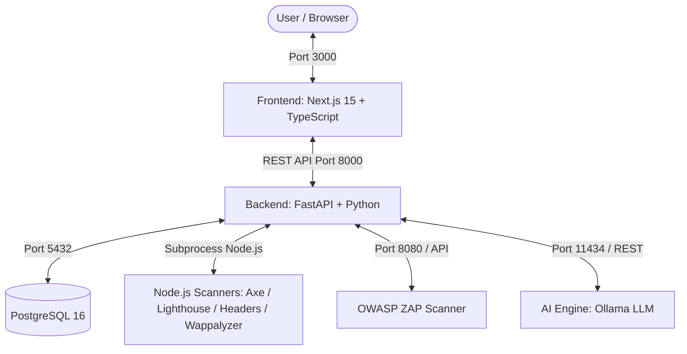

# Project Context: AI-Assisted Web Standards & Vulnerability Assessment System (WebScan / Potato)

## 1. Project Overview

ระบบประเมินมาตรฐานและความปลอดภัยของเว็บไซต์แบบอัตโนมัติ (Automated Web Standards & Security Assessment System) ที่ผสานรวมการตรวจสอบมาตรฐานสากล 4 ด้าน (71 รายการ), การสแกนช่องโหว่ความปลอดภัย และการวิเคราะห์สรุปผลด้วย AI (Local LLM via Ollama)

## 2. System Architecture & Tech Stack



### Components & Ports

| Service              | Technology                                             | Port           | หน้าที่หลัก                                                     |
| -------------------- | ------------------------------------------------------ | -------------- | --------------------------------------------------------------- |
| **Frontend**         | Next.js (App Router), TypeScript, Tailwind/Custom CSS  | `3000`         | UI กรอก URL, Dashboard แสดงผล Checklist, Charts, AI Report      |
| **Backend**          | FastAPI (Python 3.11+), SQLAlchemy, Uvicorn            | `8000`         | Orchestration, API Endpoints, ผสานรวมผลการสแกน และคุยกับ DB/AI  |
| **Database**         | PostgreSQL 16 (Alpine)                                 | `5432`         | เก็บประวัติการสแกน (`scans`, `scan_results`)                    |
| **ZAP Scanner**      | OWASP ZAP (zaproxy/zap-stable)                         | `8080`         | Spidering & Active Vulnerability Scanning                       |
| **Node.js Scanners** | Node.js Scripts (Axe, Lighthouse, Wappalyzer, Headers) | Subprocess     | ตรวจสอบ Accessibility, Performance, SEO, Tech Stack และ Headers |
| **AI Engine**        | Ollama (`qwen2.5:3b`)                                  | `11434` (Host) | วิเคราะห์ผลสแกน, สรุปความเสี่ยง, ให้คำแนะนำภาษาไทย              |

---

## 3. Standards & Scanning Modules (71 Checklist Items)

ระบบรองรับการสแกนและประเมินมาตรฐาน 4 ด้านหลัก (นิยามใน `backend/services/standards_mapping.py`):

1. **WCAG 2.1 (Web Content Accessibility Guidelines)**:
   - ตรวจสอบโดย: `axe_scan.js` + `lighthouse_scan.js`
   - ประเมิน: Contrast, Alt text, Form labels, ARIA, Keyboard accessibility
2. **Core Web Vitals & SEO**:
   - ตรวจสอบโดย: `lighthouse_scan.js`
   - ประเมิน: FCP, LCP, CLS, TBT, Meta tags, Responsive viewport
3. **สกมช. (NCSA Web Security Guidelines - Thailand)**:
   - ตรวจสอบโดย: `headers_scan.js` + `wappalyzer_scan.js` + `OWASP ZAP`
   - ประเมิน: SSL/TLS, Security Headers, Cookie flags, Outdated libraries
4. **OWASP Security Headers & Vulnerabilities**:
   - ตรวจสอบโดย: `headers_scan.js` + `OWASP ZAP`
   - ประเมิน: HSTS, CSP, X-Frame-Options, CORS, X-XSS-Protection, X-Permitted-Cross-Domain-Policies, Clear-Site-Data, SQLi/XSS alerts

---

## 4. Key Backend API Endpoints

- `POST /scan/standards`: สแกนทุก Tools พร้อมกันแบบขนาน (Concurrent) แล้วแปลงเป็น 71-item Standards Report
- `POST /scan/standard/{standard_id}`: สแกนเฉพาะมาตรฐานที่เลือก (`wcag`, `cwv`, `ncsa`, `owasp`)
- `POST /scan/wappalyzer`: สแกนตรวจจับเทคโนโลยี (Tech Stack profiling)
- `POST /scan/lighthouse`: สแกน Web Vitals & Accessibility
- `POST /scan/headers`: สแกน Security Headers, Cookies และ SSL/TLS
- `POST /scan/zap`: สแกน Active/Passive Vulnerabilities ผ่าน ZAP API
- `POST /analyze/ai`: ส่งผลสแกนให้ Ollama LLM สร้างรายงานและสรุป Risk Score
- `GET /health`: ตรวจสอบสถานะ Backend API

---

## 5. Directory Structure

```
Potato/
├── backend/
│   ├── app/                    # FastAPI Application package
│   │   ├── main.py             # App lifecycle, CORS, router mounting
│   │   ├── config.py           # Environment variables & constants
│   │   └── routes/             # Domain-specific route controllers
│   │       ├── scan.py         # /scan/* tool-level endpoints
│   │       ├── standards.py    # /scan/standards, /scan/standard/{id}
│   │       ├── ai.py           # /analyze/ai
│   │       └── health.py       # /health
│   ├── db/                     # Database layer
│   │   ├── database.py         # SQLAlchemy engine, session & init
│   │   └── models.py           # ORM Models (Scan, ScanResult, AIReport)
│   ├── services/               # Business logic & background execution
│   │   ├── scanner.py          # Node.js & ZAP subprocess execution
│   │   └── standards_mapping.py# 68-item checklist mapping logic
│   ├── tests/                  # Automated test suite
│   │   └── test_standards_mapping.py
│   ├── Dockerfile              # Backend Container Build
│   └── requirements.txt        # Python Dependencies
├── frontend/
│   ├── app/
│   │   ├── page.tsx            # Main Scan Page & Results Interface
│   │   ├── dashboard/page.tsx  # Analytics Dashboard
│   │   ├── layout.tsx          # Root Layout & Fonts
│   │   └── globals.css         # Design tokens & styling
│   ├── components/             # Reusable UI & Panel Components
│   │   ├── panels/             # Result view panels (Standards, Axe, etc.)
│   │   └── ui/                 # Shared UI elements (Navbar, Hero, etc.)
│   ├── lib/                    # Types, constants & API helpers
│   └── Dockerfile              # Frontend Next.js Build
├── scanner/
│   ├── axe_scan.js             # Puppeteer + Axe-core runner
│   ├── lighthouse_scan.js      # Lighthouse CLI/API runner
│   ├── headers_scan.js         # Security headers & TLS inspection
│   └── wappalyzer_scan.js      # Wappalyzer CLI runner
├── docs/                       # Project Documentation
│   ├── architecture.md         # System Architecture & Specs (This file)
│   ├── standards_checklist.md  # 68 Checklist Items Details
│   └── research_comparison.md  # Academic comparative study
├── .env.example                # Environment variables template
├── docker-compose.yml          # Container orchestration (db, zap, backend, frontend)
└── README.md                   # Project overview & quickstart
```

---

## 6. Environment & Configuration Guidelines

- **Docker Communication**:
  - Backend เชื่อมต่อไปยัง Ollama บน Host ผ่าน `http://host.docker.internal:11434`
  - Backend เชื่อมต่อไปยัง ZAP ผ่าน `http://zap:8080` (ใช้ API Key ร่วมกันผ่าน `ZAP_API_KEY`)
  - Backend เชื่อมต่อไปยัง DB ผ่าน `postgresql://postgres:devpass@db:5432/potato_db`
- **Frontend Hot-Reload**:
  - ใช้ `WATCHPACK_POLLING=true` ใน Docker เพื่อรองรับ Hot reload บน Windows environment
- **Local Dev vs Docker**:
  - รันทั้งระบบ: `docker compose up -d --build`

---

## 7. Guidelines for AI Agents & Developers

1. **Standards Mapping Integrity**: การแก้ไข logic การตัดเกรดหรือ checklist ให้ทำที่ `backend/services/standards_mapping.py` เสมอ
2. **Scanner Execution**: Scanners ใน `scanner/` ทำงานแบบ Subprocess CLI คืนค่าเป็น JSON เสมอ หากเพิ่ม scanner ใหม่ต้อง parse stdout และ handle timeout อย่างรัดกุมใน `backend/services/scanner.py`
3. **Database Writes**: การสแกนมาตรฐาน (`/scan/standards`) จะบันทึกผลลงใน `scans` และ `scan_results` ส่วนรายงาน AI จะบันทึกใน `ai_reports`
4. **AI Prompting**: การเรียกใช้ Ollama ใน `/analyze/ai` จะต้องจำกัด context size (`MAX_JSON_CHARS`) ป้องกัน context overflow สำหรับโมเดล `qwen2.5:3b`
